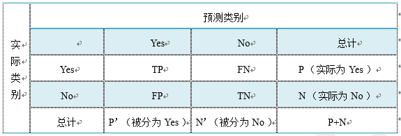

# 目录
<!-- @import "[TOC]" {cmd="toc" depthFrom=1 depthTo=6 orderedList=false} -->

<!-- code_chunk_output -->

* [目录](#目录)
* [Beyond DCG: User Behavior as a Predictor of a Successful Search](#a-hrefhttpciteseerxistpsueduviewdocdownloadjsessionid01c97894d5a8bd0d72ce7977ed9d1402doi10111536432reprep1typepdf-target_blankbeyond-dcg-user-behavior-as-a-predictor-of-a-successful-searcha)
	* [Abstract: ](#abstract-目录)
		* [1. INTRODUCTION(介绍)](#1-introduction目录介绍)
		* [2. USER SEARCH GOAL SUCCESS(用户搜索目标成功)](#2-user-search-goal-success目录用户搜索目标成功)
			* [2.1 Data(数据)](#21-data目录数据)
			* [2.2 Editorial Guidelines(编辑者指南)](#22-editorial-guidelines目录编辑者指南)
			* [2.3 Problem Definition(问题定义)](#23-problem-definition目录问题定义)
		* [3. RELATEDWORK(相关工作)](#3-relatedwork目录相关工作)
			* [3.1 Estimating Query Level Relevance(估计查询级别相关性)](#31-estimating-query-level-relevance估计查询级别相关性)
			* [3.2 Task and Session Level Evaluation(任务和会话级别评估)](#32-task-and-session-level-evaluation任务和会话级别评估)
			* [3.3 Modeling User Search Behavior(用户搜索行为建模)](#33-modeling-user-search-behavior用户搜索行为建模)
		* [4. APPROACH(方法)](#4-approach目录方法)
			* [4.1 Goals as a Sequence of Actions(目标是一系列行动的结果)](#41-goals-as-a-sequence-of-actions目录目标是一系列行动的结果)
			* [4.2 Model Language Variations(语言变体模型)](#42-model-language-variations目录语言变体模型)
			* [4.3 Building the Model(模型建立)](#43-building-the-model目录模型建立)
			* [4.4 Predicting Goal Success(预测成功的目标)](#44-predicting-goal-success目录预测成功的目标)
			* [4.5 Adding Time to the Model(模型中加入时间因素)](#45-adding-time-to-the-model目录模型中加入时间因素)
		* [5. EXPERIMENTS(实验)](#5-experiments目录实验)
			* [5.1 Static Features Based on User Search Behavior(基于用户搜索行为的静态特性)](#51-static-features-based-on-user-search-behavior目录基于用户搜索行为的静态特性)
			* [5.2 Relevance based Prediction(基于相关性的预测)](#52-relevance-based-prediction目录基于相关性的预测)
			* [5.3 Adding Time(增加时间)](#53-adding-time目录增加时间)
			* [5.4 Other Experiments(其他实验)](#54-other-experiments目录其他实验)
		* [6. DISCUSS(讨论)](#6-discuss目录讨论)
		* [7. CONCLUSIONS(结论)](#7-conclusions目录结论)
		* [8. ACKNOWLEDGMENTS(致谢)](#8-acknowledgments目录致谢)
		* [9. REFERENCES(参考文献)](#9-references目录参考文献)
		* [10. 附录](#10-附录目录)
			* [10.1 HMM模型](#101-hmm模型目录)
			* [10.2 伽马函数介绍](#102-伽马函数介绍目录)
			* [10.3 机器学习中常用的概率分布：](#103-机器学习中常用的概率分布目录)
			* [10.4 k折交叉验证](#104-k折交叉验证目录)
			* [10.5 分类算法的评估方法](#105-分类算法的评估方法目录)

<!-- /code_chunk_output -->


# <a href="http://citeseerx.ist.psu.edu/viewdoc/download;jsessionid=01C97894D5A8BD0D72CE7977ED9D1402?doi=10.1.1.153.6432&rep=rep1&type=pdf" target="_blank">Beyond DCG: User Behavior as a Predictor of a Successful Search</a>


## [Abstract: ](#目录)

说明传统搜索引擎评价方式的缺陷：
- 传统的Web搜索引擎是根据Web页面的一次查询结果与单个查询的相关性进行评估
- 然而，网页的相关性并不能说明全部情况---(因为单个查询可能只代表用户的一部分信息需求，而用户在相同的查询下可能有不同的信息需求。)

说明本文做工作：
- 本文对用户行为建模，并证明用户行为比文档相关性预测的更准确。
- 证明基于用户行为的序列和时间分布模型比静态模型和基于文档相关模型的预测精度更好

### 1. [INTRODUCTION](#目录)(介绍)

段落1：说明网页相关性的缺点，用户相同的查询内容也许具有不同的意图

段落2：举例证明第一段的论述：

>假设两个用户正在搜索 __免费的剪贴画__ 来美化文档。对于这个查询，他们每个人都看到相同的一组web搜索结果，这些结果具有相同的固定相关性或DCG[[12]](#12)。第一个用户在搜索结果的第一页找到她想要的剪贴画，单击它，将它复制到她的文档中，她的搜索目标就 __成功了__。但是，第二个用户还有别的想法。看到这些回复后，他对 __复活节宗教剪贴画__ 重新进行了查询，再次进行了查询后，最终放弃了搜索。尽管开始时使用相同的查询，使用相同的DCG，这个搜索目标是 __不成功的__。

段落3：
说明本文的工作目标 ==> 预测用户的特定搜索目标是否成功的方法
考虑的因素 ==> 查询、单击和等待时间等

段落4：说明本文贡献：
- 1.一种更加详细的评价搜索引擎的方法
- 2.全自动的评价技术
- 3.整合了时间因素的用户行为分析可以高效的预测用户搜索目标
- 4.通过实验验证了本文方法的有效性

段落5：后续章节安排

### 2. [USER SEARCH GOAL SUCCESS](#目录)(用户搜索目标成功)
Table 1: Example of a Successful Goal
|Time | Query | #clicks  | Avg. Dwell Time   |
|---|---|---|---|---|
| $t_1$  | sea bass in oven(炉中鲈鱼)  | 1  |  Short |
| $t_2$  | baked sea bass(烤鲈鱼)  | 1  | Short  |
| $t_3$  |  baked sea bass recipe(烤鲈鱼食谱) | 6  |  Long |


Table 2: Example of an Unsuccessful Goal
|Time | Query |#clicks  | Avg. Dwell Time   |
|---|---|---|---|---|
|$t_1$  | gauage mod for rfactor  |  0 | NA  |
| $t_2$  | gauges for rfactor  | 1  |  Short |
| $t_3$ |  new gauges for rfactor |  0 | NA  |
|$t_4$  |  gauges mod for rf |  0 |  NA |
| $t_5$  |  new tacks for rfactor | 1  | Short  |
| $t_6$  | rfactor gauge plugin  | 0  |  NA |

根据文献[[14]](#1)列举成功和不成功的目标。展示是否成功的表格——表1和表2

#### 2.1 [Data](#目录)(数据)

数据说明：
- 来自Yahoo的1000个用户会话的随机样本
- 搜索时间：搜索引擎在2007年4月的一个星期搜集的数据。每个用户会话持续3天：包括所有查询、搜索结果页面以及在时间段内该用户在搜索结果页面上单击的所有结果
- 三天的时间周期是任意的，但该时间段对于捕捉一些用户的扩展的搜索模式是足够长的。编辑者团队随后被指示检查每个会话并重新体验用户的体验
>注意：每个用户被指定了一个匿名标识符，注释是按照Yahoo的隐私策略进行的，没有用于将查询流映射到特定用户的信息（保证用户隐私）

#### 2.2 [Editorial Guidelines](#目录)(编辑者指南)

__Definition1. A search goal is an atomic information need, resulting in one or more queries.
定义搜索目标---
定义1:搜索目标是为了满足一个基本的信息需求，而产生一个或多个查询。__

- 目标可以看作是完成单个离散任务的一组相关查询。查询不必是连续的，但可以与来自其他目标的查询(例如，用户既要查找与工作有关的信息，又要查找晚上娱乐所需的信息)交织在一起。

- 编辑者确定每个查询的目标，并为每个查询标上目标编号。在大约5000个查询中，数据总共包含2712个不同的目标

- 成功目标与否根据的五分制来判别:
	- 绝对成功
	- 可能成功
	- 不确定
	- 可能不成功
	- 肯定不成功
- 编辑者根据<a target='_blank' href="https://baike.baidu.com/item/%E7%9D%80%E9%99%86%E9%A1%B5/6376579?fr=aladdin">登录页面(landing page)</a>的内容和其结果与查询条目的匹配度以及用户在一个目标中实际的查询序列(例如,用户是否看起来在增加查询规则)以及搜索结果的点击模式等信息进行判断。编辑者需要经过一定时间的训练以保证标签标注的一致性。
- 以这种方式重新执行用户的搜索，并试图评估用户在找到所需信息方面的成功程度，这个过程会有一定偏差。在会话级别判断成功与否的编辑的好处是，他们有大量的上下文来帮助他们确定不明确的情况。而如果为单个查询或页面浏览量判断是否成功时，编辑者根本没有这个上下文，因此解释用户的意图变得更加困难
- 对于一个目标内从一个查询到下一个查询的每个转换，编辑者将该转换标记为 __通用、专门化、并行移动或相同含义(generalization, specialization, parallel move or same-meaning)__。对于每个用户会话的一个查询，编辑者还用 __五个分值(完美、优秀、好、一般、坏)__ 给纪录片贴上相关性判断的标签。

#### 2.3 [Problem Definition](#目录)(问题定义)

- 用户动作：用户一次查询得到一个结果网页，之后用户会点击0或者更多结果，接着会停止查询或者进行下一次查询

- 每个用户会话包含一个或多个目标，每个目标包含一个或多个查询。本文的目的是给定一个搜索目标，判断该目标是否成功达成

- 为了将编辑判断转换为二元分类任务，作者将 __绝对成功__ 和 __可能成功__ 的目标视为 __积极类__，而将 __所有其他目标__ 视为 __消极类__。

>>>这里没看懂！
在这项工作中，作者假设将查询序列及其相关的单击划分为目标已经执行了预处理步骤。使用编辑署名的目标标签。也可使用论文[[14]](#14)中有自动目标分割方法，准确率在92%左右。通过使用oracle编辑目标标签，可以检验与目标识别任务分离的目标成功预测

### 3. [RELATEDWORK](#目录)(相关工作)

#### 3.1 Estimating Query Level Relevance(估计查询级别相关性)
web搜索的查询结果集相关性度量技术的现状使用相关度量，如折扣累积收益(DCG)[[12]](#12)。
#### 3.2 Task and Session Level Evaluation(任务和会话级别评估)
略

#### 3.3 Modeling User Search Behavior(用户搜索行为建模)
略

### 4. [APPROACH](#目录)(方法)

模型简述：后文中描述一个模型，在给定搜索目标的情况下，该模型可以预测搜索是否成功。构建两个[马尔可夫模型](#101-hmm模型目录)，描述搜索目标成功和不成功时的用户行为。给定一个新的搜索目标，比较其在两个模型中的测试目标的可能性，以决定它是成功还是失败的目标。
此模型不考虑用户操作之间的时间间隔。在4.5节中，描述了一种将时间与用户行为结合起来以更好地预测目标成功的方法。

#### 4.1 [Goals as a Sequence of Actions](#目录)(目标是一系列行动的结果)

给定一个动作集合$a_1...a_n$，一个目标可以定义为：$$G=<START,<a_1,t_1>,...,<a_n,t_n>,END>$$
其中START和END代表开始和结束。
$a_1,...,a_n\in A= \{Q,SR,AD,RL,SP,SC,OTH\}$代表可能的动作集合
$t_1,...,t_n \in N$代表两个动作之间的间隔时间。

一个目标中可能出现以下类型的操作:
- START
- A Query(Q)---一次查询
- A click of any of the following types:
	- Algorithmic Search Click (SR)---算法搜索点击(作者写错了？[table 6]Search Result)
	- Sponsored Search Click (AD)---赞助搜索点击
	- Related Search Click (RL)---相关搜索点击
	- Spelling Suggestion Click (SP)---拼写建议点击
	- Shortcut Click (SC)---快捷键点击
	- Any Other Click (OTH), such as a click on one of the tabs
- END: the user ends the search goal (manually labeled in our data)---用户结束搜索目标

以上大部分点击的意义不言自明。
这里着重介绍了相关搜索(RL)和快捷键点击(SC)：
- RL即相关搜索单击是对类似于用户查询的查询的单击。当其他人进行了与用户搜索类似的搜索时，搜索引擎会列出类似的查询。
- SC即快捷方式是一种快速获取用户所需信息的方法。当它与用户的搜索相关时，它会自动出现。快捷方式的例子有图片、视频、新闻等等。

举例:
一个用户查询“guess(猜测)”，4秒后点击相关搜索建议“guess watches(兴趣)”，一秒后用户点击了第一个搜索结果，53秒后用户点击了第三个结果，又过了118秒，这次搜索目标结束。这个过程可以如下序列动作表示：
$Q_{4s} RL_{1s} SR_{53s} SR_{118s} END$


#### 4.2 [Model Language Variations](#目录)(语言变体模型)
一些动作也可以与数字相关联。例如：
- $Q$可以替换为$\{Q\}\times N$来区分第一个查询和第二个查询等等。这可以在几个粒度级别上定义。可以决定只区分第一个查询和其他查询。
- 同样，也可以用$\{SR\}\times N$替换$SR$来区分不同位置上的点击。数字可以表示结果位置、出现的页码或任何其他自定义定义

例如：$Q_{4s} RL_{1s} SR_{1\quad53s} SR_{3\quad118s} END$

#### 4.3 [Building the Model](#目录)(模型建立)


(a)The model given only 1 training instance(给定一个训练实例的模型)

(b)The model given only 2 training instances(给定两个训练实例的模型)
Figure 1: Sequences of actions could represent a path in a graph(动作的序列可以表示图形中的路径)

解释图1的内容：
该图可以定义为$G=(V,E,w)$，其中：
- $V=\{Q,SR,AD,RL,SP,SC,OTH\}$用户进行一次目标搜索是可能的动作集合
- $E\subseteq V\times V$任意两个动作直接可能的转移的集合
- $w:E \rightarrow [0..1]$代表给定每一个状态对$(S_i,S_j)$的权重函数，一个权重$w(S_i,S_j)$代表从状态$S_i$转移到状态$S_j$的概率。

这个图简单地表示了目标期间用户行为的马尔可夫模型。马尔可夫模型的状态空间是行为的集合，任意两种状态$S_i$和$S_j$之间的转移概率利用极大似然估计估计评估如下：
$$Pr(S_i,S_j)=\frac{N_{s_i,s_j}}{N_{s_i}}$$
<!--  -->
其中$N_{s_i,s_j}$从状态$S_i$转移到状态$S_j$出现的次数，$N_{s_i}$代表训练数据中状态$S_i$出现的总次数。


#### 4.4 [Predicting Goal Success](#目录)(预测成功的目标)
作者把训练数据分成两部分：
- 第一个包含所有成功的目标
- 第二个包含所有不成功的目标

根据上一节描述的方法，作者构建了两个马尔可夫模型：
- 第一个模型$M_s$描述了成功目标中的用户行为
- 第二个模型$M_f$描述了不成功目标中的用户行为。

给定一个新的用户目标，可以使用这两个模型来估计这个动作序列从两个模型中产生的可能性。给定模型$M$，动作序列$S =(S_1,S_2,...,S_n)$，该动作序列由$M$生成的概率为：

$Pr_M(S)=\prod_{i=2}^n Pr(S_i|S_1,...,S_{i-1})=\prod_{i=2}^n W(S_{i-1},S_i)$
<!--  -->
其中$n$是序列中的动作数目，$W$是概率转移函数。

对数似然定义如下：

$LL_M(S)=\Sigma_{i=2}^nW(S_{i-1},S_i)$
<!--  -->
成功的目标定义如下：

$$
Pred(S)=\left\{
\begin{aligned}
&1 &if\frac{LL_{M_S}(S)}{LL_{M_f}(S)}>\tau \\
&0 &otherwise.
\end{aligned}
\right.
$$
<!--  -->
其中:
- $S$是目标的动作序列
- $LL_{M_S}(S)$是给定成功模型目标的对数似然
- $LL_{M_f}(S)$是给定失败模型目标的对数似然
- 阈值$\tau$通常设定为1

#### 4.5 [Adding Time to the Model](#目录)(模型中加入时间因素)
作者发现点击时的长间隔时间对与成功的预测非常重要。

假设有一个独特的分布来控制用户在每次转换上花费的时间
- 该分布控制用户在状态$S_i$上花费的时间
- 为每个可能的状态$S_i$转移到状态$S_j$
- 每个转换的分布是根据训练数据估计的
- 从训练集中的每个转换收集所有目标的转换时间，并使用它们来估计该转换的时间分布，如图2所示

Figure 2: Time distributions are estimated for each transition(估计了每个转换的时间分布)

第一步是选择时间分布的参数形式：
- [伽马分布](#102-伽马函数介绍目录)是一个含有两个参数族的一种丰富的连续分布的分布函数
- 有一个尺度参数$\theta$，和一个形状参数$k$
- 如果$k$是一个整数，这个分布代表$k$个独立的指数分布随机变量的和[[9]](#9)
- 伽马分布常被用作等待时间的概率模型[[9]](#9)

伽马分布的概率密度函数如下：

$f(x:k;\theta)=x^{k-1}\frac{e^{-x/\theta}}{\theta^k\Gamma(k)}其中 x,k,\theta>0$--------------(1)
<!--  -->
给定$N$个独立同分布的观察变量$(x_1,...,x_N)$，对于两个状态$S_i$和$S_j$的转移时间的似然函数为：

$L(k,\theta)=\prod_{i=1}^n f(x_i;k,\theta)$----------------(2)
<!--  -->
将公式(1)带入公式(2)，找到最大似然对应的$\theta$值:

$\hat\theta=\frac{1}{KN}\Sigma_{i=1}^n x_i$
<!--  -->
求出最大似然函数对应的$k$值：
$ln(k)-\psi(k)\approx\frac 1k(\frac 12+\frac 1{12k+2})\hat\theta=\frac 1{KN}\Sigma_{i=1}^n x_i$
<!--  -->
按照以上公式可以得到数值解。

再次将训练数据分成两部分：
- 第一个包含所有成功的目标
- 第二个包含所有不成功的目标

然后估计这个模型中每两个状态直接转变的等待时间的伽马分布参数。给出了一个新的目标，估计了从成功模型生成转换时间的可能性以及从失败模型生成转换时间的可能性。然后将这两个概率的比值作为 __特征(?)__，以及序列模型的似然比作为预测成功的指标。


Figure 3: Time distributions of SR→Q transitions for successful and unsuccessful search goals.(状态SR->Q的等待时间中成功与失败搜索目标的时间分布图)

作者的假设是：
- 对于成功和失败模型，一些用户在进行某些状态转换时具有不同的时间分布
- 因此，状态转移时间的似然比可以作为次过程的预测指标。

图3比较了搜索结果单击和查询提交之间转换时间的估计时间分布。从图中可以看出：
- 用户倾向于在成功的目标中 __花费更多的时间__ 来查看搜索结果，即长时间停留在一次点击上标志着这是一次良好点击
- 用户在目标不成功的情况下倾向于 __花费较少的时间__ 在搜索结果上进行对比，即用户会快速返回并重写查询内容。


### 5. [EXPERIMENTS](#目录)(实验)

实验设置：

- 从商业搜索引擎的查询日志中获得2712个目标
- 人类手工编辑指示将目标分类为成功或不成功，如[2.2节](#22-editorial-guidelines目录编辑者指南)所述
- 作者使用梯度增强决策树(GBDT)作为分类器[[8]](#8)。
- 所有试验均采用[10折交叉验证法](#104-k折交叉验证目录)
- 根据[精确度、召回率、f值和准确度](#105-分类算法的评估方法目录)来评估结果
- 采用双尾t检验统计显著性

#### 5.1 [Static Features Based on User Search Behavior](#目录)(基于用户搜索行为的静态特性)

实验的第一个基线将这个问题作为一个经典的机器学习问题进行处理，在这个问题中提出一组特性并使用它们来训练分类器。作者测试了许多特性，这里描述了性能最好的特性如下：

```
Features(特征)
------------------
Number of queries during goal                      目标期间的查询数量
Number of clicks during goal                       目标期间的点击数量
Number of clicks on sponsored results during goal  目标期间赞助结果的点击次数 
Number of clicks on next page during goal          目标期间下一页的点击次数
Number of clicks on spell suggestion during goal   目标期间点击拼写建议的次数
Number of clicks on also try during goal           目标期间点击尝试次数??
Number of clicks on shortcut during goal           目标期间快捷方式的点击次数
Maximum time between clicks during goal            目标期间的最大点击间隔时间
Minimum time between clicks during goal            目标期间的最小点击间隔时间
Average time between clicks during goal            目标期间的平均点击间隔时间
Time span of goal                                  目标时间跨度
Average time to first click during goal            目标过程中第一次点击的平均时间
Average dwell time                                 平均滞留时间
```

其中一个重要特性是 __滞留时间__。滞留时间是一次点击击与下一个操作(查询、单击或结束)之间的时间量。作者计算目标执行期间所有单击的滞留时间，并使用最大、最小和平均滞留时间作为特征来预测成功与否。


Figure 4: Precision-Recall Curves for Markov Model Likelihood ,MML) and static features classifiers


Table 3: Precision, Recall, F1, and Accuracy for Static Features, Markov Model, and Markov Model + Time Classifiers. Each set of results separated by horizontal bars has statistically significantly higher accuracy than the set above it

图4比较了静态特征分类器和本文提出的基于马尔可夫模型似然的方法(简称MML)的精度召回率曲线。表3显示了静态特征分类器、滞留时间分类器和本文所提方法的精度、召回率、f1值和准确度。阈值由梯度增强的决策树分类器(GDBT)设置。作者注意到：
- 滞留时间特性与静态特性相比表现良好，通过它获得的性能与使用所有静态特性的性能相当
- 马尔可夫模型方法明显优于静态特征和滞留时间分类器。各项指标都有很大改进
- 本文方法的精度提高了6个点以上，是静态特征分类器精度的9%

马尔可夫模型的动作序列模型与静态特征分类器相比有几个优点：
- 两种模型都试图描述用户在搜索过程中的行为
- 然而，静态特征分类器使用的是描述用户行为的聚合特征。虽然简单、易于计算，但它忽略了许多固有的细节
- 另一方面，马尔可夫模型动作序列方法能更准确地描述用户的行为

作者还尝试将从MML中获得的分数作为一个特征，将其添加到静态特性中。该分类器的性能如表3(3,4行)所示。作者发现，当把静态特性添加到MML特性中时，并没有得到任何改进。因此可以认为， __对用户行为建模可以捕获静态特性捕获的所有信息。__

#### 5.2 [Relevance based Prediction](#目录)(基于相关性的预测)

- Huffman和Hochster[[10]](#10)表明，用户满意度和相关性指标之间存在很强的相关性。
- 在本节中，作者与[[10]](#10)的方法进行比较。
- 他们在目标中使用第一个查询的相关性来预测搜索成功。他们使用一个简单的位置加权平均值，它来自于折扣累积收益(DCG)[[12]](#12)系列度量。在[五分制计量表](#22-editorial-guidelines目录编辑者指南)上给出了相关性的判断，他们将这些判断进行了缩放，使其介于0和1之间，并将它们的总体计算公式为：
$Relevance=\frac{R_{pos1}+R_{pos2}/2+R_{pos3}/3}{1+\frac 12+\frac 13}$----------------(3)
<!--  -->
其中$R_{pos1},R_{pos2},R_{pos3}$是前三个结果在0与1之间的相关性判断。

- 作者为了与他们的结果相比较而以这种方式实现DCG
- 作者还以更标准的形式实现了DCG，如下公式所示：

$DCG_p=rel_1+\Sigma_{i=2} (p\frac{rel_i}{log i})$
<!--  -->
其中$rel_i$代表五分制计量下位置$i$中的相关性结果。


Figure 5: Precision-Recall Curves for Markov Model Likelihood ,MML) and Relevance ,DCG) based Prediction.

作者比较了自己的方法和DCG方法，图5比较了基于关联(DCG)的分类器和基于用户动作序列的马尔可夫模型的精度召回率曲线


Table 4: Precision, Recall, F1, and Accuracy for Relevance(Eqn. 3), DCG, Markov Model and Markov Model + DCG classifiers, cross-validated on the subset of 607 goals for which we have query-url relevance judgments.

表4显示了基于公式3和DCG[[12]](#12)的两个相关分类器以及MML方法的精度、召回率、f1值和准确度。可以看出：
- 前两行数据说明两个基于相关性的指标执行起来几乎是相同的。这种差异没有统计学意义
- 图5中除了非常低的召回率，马尔可夫模型方法在精度召回率曲线上的所有操作点上都优于基于相关性的方法，整体平均精确度提高了近6点，但召回率下降了1点
- 马尔科夫分类器准确率提高了5个点以上，比基于相关性方法的提高了6.5%
- 将MML方法与DCG结合时，没有任何统计上的显著改善

接下来又举了两个例子论证马尔科夫模型确实优于相关性模型（用了两大段说明）：

例1：
- 用户输入查询“家具拍卖”
- 前三个结果的相关性判断分别为优、良、优，适用于想购买家具的人的家具拍卖。从相关性来看，这个目标似乎是成功的
- 然而，用户实际上是打算在拍卖中出售家具;重写查询以将其卖给家具拍卖公司以反映此意图，结果用户未能找到他想要的
- 另一方面，用户的行为符合用户失败模型特征的行为，其行为序列由成功和失败模型生成的可能性比清楚地表明他没有成功

例2：
- 用户输入查询“Pembroke Pines的房主出售的房屋”。前三个结果的相关性判断分别为差、差和公平，导致基于相关性的模型将目标标记为不成功
- 但是，按照相关性进行预测的结果是错误的，因为用户最终在位置11处找到了他正在查看的结果
- 而该行为模型与使用马尔科夫模型的用户行为成功模型所描述的行为一致

#### 5.3 [Adding Time](#目录)(增加时间)

>增加时间我的理解是HMM的计算时在每两个状态之间直接乘以时间分布对应的概率

目前为止，所描述的实验只使用了用户操作的顺序，没有考虑时间。本节按照第[4.5节](#45-adding-time-to-the-model目录模型中加入时间因素)的描述为每一个转移的成功和不成功的模型拟合了一个伽马时间分布。

Figure 6: Precision-Recall Curves for Markov Model Likelihood (MML) and Markov Model Likelihood with Time.
图6比较了基于马尔科夫模型的方法在有时间和没有时间的情况下的精度召回率曲线。
表3给出了两种方法的精度、召回率、f测度和准确度。
作者注意到:
- 添加时间可以提高精度、召回率和准确读。通过向模型中添加时间，可以获得大约2%的准确率提升。同时发现单独使用时间效果也非常好(图6)
- 该方法比使用上面描述的静态特性基线要好得多
- 在低召回率条件下，单独使用时间甚至优于基于用户行为序列的马尔科夫模型
- 马尔可夫行动序列模型更适合中、高召回率情况。结合这两种模型得到的分类器优于单独使用这两种模型

#### 5.4 [Other Experiments](#目录)(其他实验)

在本节中，作者描述其他几个实验。一些实验产生了消极的结果，一些产生了积极的结果，其余的保持了性能不变。

在第一组实验中，改变了马尔可夫模型：
- 将单个查询状态Q替换为其他几个状态，以区分第一个查询和第二个查询等[(如4.2)](#42-model-language-variations目录语言变体模型)状态。这种变化导致的性能差异没有带来统计学意义上的变化
- 另一个假设是不同类型的查询转换在区分成功和不成功目标方面可能有不同的含义：
作者将开始查询与重写查询区分开来，在重写查询时，用户重写查询以 __通用、专门化、并行移动或相同含义(generalization, specialization, parallel move or same-meaning)__ (使用[2.2节中描述的编辑标记](#22-editorial-guidelines目录编辑者指南))，总共有五种查询状态。同样，这种变化导致的性能差异在统计学上也不是显著的
- 作者还尝试将不同位置的单击映射为某种状态。尝试为不同的页面大小添加单击位置或页面位置。当以5为增量对单击结果的排名进行建模时，获得了最佳性能。例如，单击前5个位置之一将映射到状态$SR_{1-5}$。单击从6到10的位置上的一个结果将映射到状态$SR_{6-10}$，以此类推


- 图7比较了基于马尔可夫模型似然方法在搜索结果位置存在和不存在的情况下的精度召回率曲线。这一修改，使得性能略有提高。作者认为这是因为单击结果的位置可以代表结果的相关性，并且在搜索结果单击之后，用户行为会根据结果是否相关而发生变化

一阶马尔可夫模型假设下一个状态只依赖于当前状态。作者对数据进行了高阶马尔可夫模型的训练，并将其性能与一阶模型进行了比较：
- 对二阶和三阶马尔可夫模型进行了训练，结果性能下降了

### 6. [DISCUSS](#目录)(讨论)

| Action following query  | Odds-ratio  |
|---|---|
| SC(快捷键点击)  | 2.0  |
| SR(算法搜索点击)  | 1.8  |
| RL(相关搜索点击)  | 1.2  |
| SP(拼写建议点击)  | 0.9  |
| Q(一次查询)   | 0.5  |
| OTH(任何其他点击) | 0.3  |
| END | 0.1  |
Table 5: Odds-ratio of transitions from query to other actions in successful goals, compared to unsuccessful goals.

讨论主题：讨论马尔可夫模型中观察成功和失败目标的转移概率的比

在表5中，作者看到成功目标中从查询到其他操作的转换概率与不成功目标的转换概率之比，得出结论：
- 在成功的目标中，用户点击快捷键的可能性是点击搜索结果的两倍
- 用户更有可能单击拼写建议并发出新的查询，而不会单击目标不成功的任何搜索结果
- 不成功的目标在没有任何类型的单击的情况下结束的可能性是不成功目标的十倍，即从查询到最终状态的转换，也称为废弃查询
- 放弃本身并不是文档相关性或目标成功的完美预测器，因为许多查询可以通过文档片段[[16]](#16)来满足，但是它可以作为整个搜索目标模型的一部分的有用信息

| Action leading to end  | Odds-ratio  |
|---|---|
| SR(搜索结果点击)  | 1.5  |
| SC(快捷键点击)  | 1.2  |
| OTH(任何其他点击)  | 1.0  |
| RL(相关搜索点击)  | 0.7  |
| Q(一次查询)  | 1.0  |
Table 6: Odds-ratio of transitions to end from other actions in successful goals, compared to unsuccessful goals

在表6中，作者计算了成功模型与失败模型中过渡概率到最终状态的<a target='_blank' href="https://baike.baidu.com/item/%E6%AF%94%E5%80%BC%E6%AF%94/3078146?fr=aladdin">比值比</a>。发现：
- 成功的目标更有可能从搜索结果点击过渡到最终状态
- 失败的目标更有可能从查询或相关搜索过渡到最终状态。

| Highly probable successful paths  |
|---|
|  Q SR END |
| Q SR SR END |
| Q SR SR SR END |
| Q SR SR SR SR END |
| Q AD END|
| Q SC END|
| Q SR Q SR SR END|
Table 7: Some of the highly probable successful paths.

作者通过观察马尔科夫模型中可能出现的序列来获得更多的信息。表7显示了通过马尔可夫模型实现成功搜索的一些最可能的路径。作者发现：
- 一个查询之后单击一、二或三次很可能成功
- 重新构造的查询，然后单击两次，也很可能成功。

| Highly probable unsuccessful paths  |
|---|
| Q END |
| Q Q END |
| Q OTH END |
| Q SR Q END |
| Q Q Q END |
| Q RL END |
| Q Q SR Q SR Q END |
Table 8: Some of the highly probable unsuccessful paths.

在表8中，显示高概率不成功的目标的搜索路径发现：
- 没有后续单击的查询或重新定制的查询很可能不成功


数据训练时还有一个重要的问题是训练用户搜索目标成功的模型需要多少数据。  作者构建了一条学习曲线，如图8所示，将测试集的大小固定为数据的十分之一，并改变训练集的大小。进行了十次交叉验证。作者发现：
- 增加更多的数据会继续提高精度
- 表明向该模型中添加更多数据可能会带来更好的结果


### 7. [CONCLUSIONS](#目录)(结论)


作者通过上述所有论证证明：
- 训练用户行为的有监督马尔可夫模型，包括用户搜索目标中所有查询和单击的顺序以及交互之间的时间，可以帮助我们预测用户在该目标上的成功与否
- 该模型比DCG中量化的基于查询url相关性的预测更准确
- 将目标成功度量与用户花费精力的度量(例如花费在阅读上的时间的度量)相关联，可以提供用户web搜索满意度的完整结果


### 8. [ACKNOWLEDGMENTS](#目录)(致谢)

感谢Tony Thrall和Isabella Barbier设计了该工作的数据采集

### 9. [REFERENCES](#目录)(参考文献)
<a name="1" target="_blank" href="http://citeseerx.ist.psu.edu/viewdoc/download;jsessionid=0984BD4F40C6A7739D1787F0AF9C47DA?doi=10.1.1.120.1145&rep=rep1&type=pdf">[1] E. Agichtein, E. Brill, and S. T. Dumais. Improving web search ranking by incorporating user behavior information. In SIGIR 2006: Proceedings of the 29th annual international ACM SIGIR conference on Research and development in information retrieval, pages 19{26, New York, NY, USA, 2006. ACM.</a>

<a name="8" target="_blank" href="https://projecteuclid.org/download/pdf_1/euclid.aos/1013203451">[8] J. H. Friedman. Greedy function approximation: A gradient boosting machine. Annals of Statistics ,29:1189–1232, 2001.</a>

<a name="9" target="_blank" href="https://www.researchgate.net/publication/324297280_Introduction_to_Mathematical_Statistics">[9] R. V. Hogg and A. T. Craig. Introduction to Mathematical Statistics. Macmillan, New York, 4th edition edition, 1978.</a>

<a name="10" target="_blank" href="">[10] S. B. Huffman and M. Hochster. How well does result relevance predict session satisfaction? In Procee dings of the 30th annual international ACM SIGIR conference on Research and development in
information retrieval, pages 567–574, 2007.</a>

<a name="12" target="_blank" href="http://citeseer.ist.psu.edu/viewdoc/download;jsessionid=116CFDE897772BE807F54048E2A4AEE9?doi=10.1.1.20.3161&rep=rep1&type=pdf">[12] K. Jarvelin and J. Kekalainen. Cumulated gain-based evaluation of IR techniques. ACM Transactions on Information Systems, 20(4):422-446, 2002.</a>

<a name="14" target="_blank" href="http://citeseer.ist.psu.edu/viewdoc/download;jsessionid=FDCE7A55ECEB4FE62F64C93E2D036102?doi=10.1.1.141.6865&rep=rep1&type=pdf">[14] R. Jones and K. L. Klinkner. Beyond the session timeout: Automatic hierarchical segmentation of search topics in query logs. In Proceedings of ACM 17th Conference on Information and Knowledge Management (CIKM 2008), 2008.</a>

<a name="16" target="_blank" href="http://citeseerx.ist.psu.edu/viewdoc/download;jsessionid=0579F773B3DC6368D726300F4C3411BD?doi=10.1.1.308.2812&rep=rep1&type=pdf">[16] J. Li, S. Huffman, and A. Tokuda. Good abandonment in mobile and pc internet search. In SIGIR ’09: Proceedings of the 32nd international ACM SIGIR conference on Research and development in information retrieval, pages 43–50, New York, NY, USA, 2009. ACM.</a>


### 10. [附录](#目录)

#### 10.1 [HMM模型](#目录)
<a target="_blank" href="https://www.cnblogs.com/pinard/p/6945257.html">隐马尔科夫模型HMM（一）HMM模型</a>
<a target="_blank" href="http://www.cnblogs.com/pinard/p/6955871.html">隐马尔科夫模型HMM（二）前向后向算法评估观察序列概率</a>
<a target="_blank" href="http://www.cnblogs.com/pinard/p/6972299.html">隐马尔科夫模型HMM（三）鲍姆-韦尔奇算法求解HMM参数</a>
<a target="_blank" href="http://www.cnblogs.com/pinard/p/6991852.html">隐马尔科夫模型HMM（四）维特比算法解码隐藏状态序列</a>

#### 10.2 [伽马函数介绍](#目录)
腾讯的工程师介绍伽马函数的博客：
<a target="_blank" href="http://www.flickering.cn/%e6%95%b0%e5%ad%a6%e4%b9%8b%e7%be%8e/2014/06/%e7%a5%9e%e5%a5%87%e7%9a%84%e4%bc%bd%e7%8e%9b%e5%87%bd%e6%95%b0%e4%b8%8a/">神奇的伽马函数（上）</a>
<a target="_blank" href="http://www.flickering.cn/%E6%95%B0%E5%AD%A6%E4%B9%8B%E7%BE%8E/2014/07/%E7%A5%9E%E5%A5%87%E7%9A%84%E4%BC%BD%E7%8E%9B%E5%87%BD%E6%95%B0%E4%B8%8B/">神奇的伽马函数（下）</a>

#### 10.3 [机器学习中常用的概率分布：](#目录)
<!--
  


-->
  


#### 10.4 [k折交叉验证](#目录)
1. 将含有N个样本的数据集，分成K份，每份含有N/K个样本。选择其中1份作为测试集，另外K-1份作为训练集，测试集就有K种情况。 
2. 在每种情况中，用训练集训练模型，用测试集测试模型，计算模型的泛化误差。
3. 交叉验证重复K次，每份验证一次，平均K次的结果或者使用其它结合方式，最终得到一个单一估测，得到模型最终的泛化误差。 
4. 将K种情况下，模型的泛化误差取均值，得到模型最终的泛化误差。
**注**：
1. 一般2<=K<=10。 k折交叉验证的优势在于，同时重复运用随机产生的子样本进行训练和验证，每次的结果验证一次，10折交叉验证是最常用的。
2. 训练集中样本数量要足够多，一般至少大于总样本数的50%。 
3. 训练集和测试集必须从完整的数据集中均匀取样。均匀取样的目的是希望减少训练集、测试集与原数据集之间的偏差。当样本数量足够多时，通过随机取样，便可以实现均匀取样的效果。

#### 10.5 [分类算法的评估方法](#目录)
1. **几个常用的术语**
这里首先介绍几个*常见*的 模型评价术语，现在假设我们的分类目标只有两类，计为正例（positive）和负例（negative）分别是：
 1) True positives(TP):  被正确地划分为正例的个数，即实际为正例且被分类器划分为正例的实例数（样本数）；
 2) False positives(FP): 被错误地划分为正例的个数，即实际为负例但被分类器划分为正例的实例数；
 3) False negatives(FN):被错误地划分为负例的个数，即实际为正例但被分类器划分为负例的实例数；
 4) True negatives(TN): 被正确地划分为负例的个数，即实际为负例且被分类器划分为负例的实例数。　



上图是这四个术语的混淆矩阵。
1）P=TP+FN表示实际为正例的样本个数。
2）True、False描述的是分类器是否判断正确。
3）Positive、Negative是分类器的分类结果，如果正例计为1、负例计为-1，即positive=1、negative=-1。用1表示True，-1表示False，那么实际的类标=TF\*PN，TF为true或false，PN为positive或negative。
4）例如True positives(TP)的实际类标=1\*1=1为正例，False positives(FP)的实际类标=(-1)\*1=-1为负例，False negatives(FN)的实际类标=(-1)\*(-1)=1为正例，True negatives(TN)的实际类标=1\*(-1)=-1为负例。

2. **评价指标**
    1) 正确率（accuracy）
    正确率是我们最常见的评价指标，accuracy = (TP+TN)/(P+N)，正确率是被分对的样本数在所有样本数中的占比，通常来说，正确率越高，分类器越好。
    2) 错误率（error rate)
    错误率则与正确率相反，描述被分类器错分的比例，error rate = (FP+FN)/(P+N)，对某一个实例来说，分对与分错是互斥事件，所以accuracy =1 -  error rate。
    3) 灵敏度（sensitive）
    sensitive = TP/P，表示的是所有正例中被分对的比例，衡量了分类器对正例的识别能力。
    4) 特效度（specificity)
    specificity = TN/N，表示的是所有负例中被分对的比例，衡量了分类器对负例的识别能力。
    5) 精度（precision）
    精度是精确性的度量，表示被分为正例的示例中实际为正例的比例，precision=TP/(TP+FP)。
    6) 召回率（recall）
    召回率是覆盖面的度量，度量有多个正例被分为正例，recall=TP/(TP+FN)=TP/P=sensitive，可以看到召回率与灵敏度是一样的。
    7) 其他评价指标
    计算速度：分类器训练和预测需要的时间；
    鲁棒性：处理缺失值和异常值的能力；
    可扩展性：处理大数据集的能力；
    可解释性：分类器的预测标准的可理解性，像决策树产生的规则就是很容易理解的，而神经网络的一堆参数就不好理解，我们只好把它看成一个黑盒子。
    8) 查准率和查全率反映了分类器分类性能的两个方面。如果综合考虑查准率与查全率，可以得到新的评价指标F1测试值，也称为综合分类率：$F1=\frac{2 \times precision \times recall}{precision + recall}$
     为了综合多个类别的分类情况，评测系统整体性能，经常采用的还有微平均F1（micro-averaging）和宏平均F1（macro-averaging ）两种指标。宏平均F1与微平均F1是以两种不同的平均方式求的全局的F1指标。其中宏平均F1的计算方法先对每个类别单独计算F1值，再取这些F1值的算术平均值作为全局指标。而微平均F1的计算方法是先累加计算各个类别的a、b、c、d的值，再由这些值求出F1值。由两种平均F1的计算方式不难看出，宏平均F1平等对待每一个类别，所以它的值主要受到稀有类别的影响，而微平均F1平等考虑文档集中的每一个文档，所以它的值受到常见类别的影响比较大。


<!-- 如果隐藏公式图片，则输入下面这句话，否则请注释下面那句话 -->
<!-- @import "hide.js"  -->